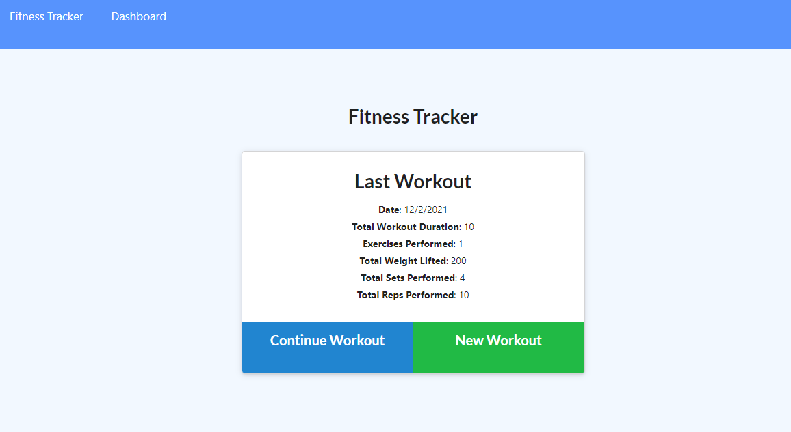
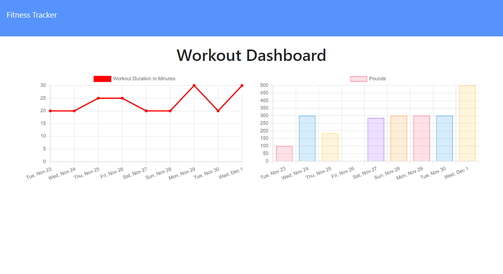

# Workout-Tracker

## Description
This fitness tracker can be used to track daily workouts when users add their workout routines to the application. The tracker will log your daily workouts in the dashboard where it will track your workout duration and weight. This fitness tracker was made using mongoDB and mongoose.js.

## Screenshot

## Heroku deploy
https://workout-tracker-aa.herokuapp.com/
